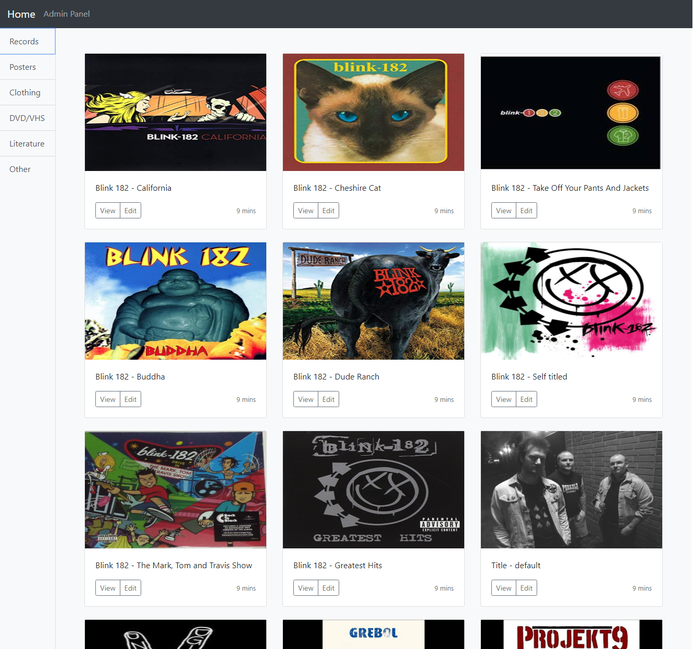

# WebShop
Work in progress...

## Backend
Start the IIS Express Web Server by open `WebShop.sln` and run the soultion . Copy the the `applicationUrl` in `launchSettings.json` and replace all `rootURL` variables in the `Angular7` folder.

## Frontend 

Run `ng serve` for a dev server. Navigate to `http://localhost:4200/`. The app will automatically reload if you change any of the source files.

